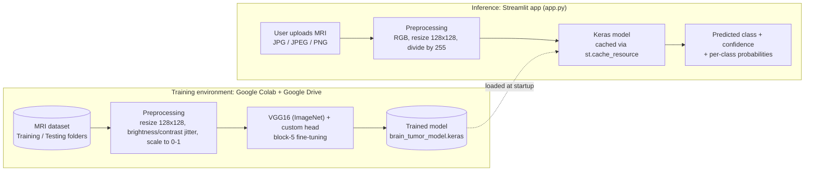
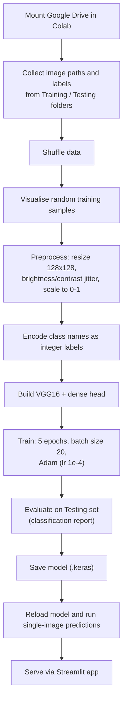
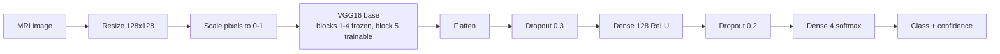

# 🧠 Brain Tumor Detection using VGG16

**A transfer-learning MRI classifier that sorts brain scans into glioma, meningioma, pituitary tumor, or no tumor — with a Streamlit app for single-image inference.**

[](https://github.com/harshantla-cloud/BRAIN-TUMOR-DETECTION-VGG16)


[](https://colab.research.google.com/github/harshantla-cloud/BRAIN-TUMOR-DETECTION-VGG16/blob/main/code.ipynb)

This project fine-tunes an ImageNet-pretrained **VGG16** network to classify brain MRI images into four categories, and wraps the trained model in a **Streamlit** interface that returns a predicted class, a confidence score, and per-class probabilities. It was built to demonstrate an end-to-end computer-vision workflow — data loading, preprocessing, transfer learning, evaluation, and a usable inference front end — on a medical-imaging problem. It is an educational project and **not** a clinical tool.

---

## 🚀 Project Overview

| | |
|---|---|
| **Problem** | Reading brain MRI scans and distinguishing tumor types is slow, expertise-heavy work. Automated triage support is an active application area for computer vision. |
| **Proposed solution** | A VGG16-based convolutional classifier (transfer learning + partial fine-tuning) that maps a 128 × 128 MRI image to one of four classes, served through a lightweight web app. |
| **Target users** | Students, ML practitioners, and reviewers evaluating transfer learning on medical images. Not intended for clinical use. |
| **Real-world use case** | Prototype of an image-classification decision-support component: upload a scan, get a class prediction with a confidence indicator. |
| **Key value** | Demonstrates a complete, reproducible path from raw image folders to a deployable inference app, with honest reporting of held-out test performance. |

---

## 🎯 Objectives

- Classify brain MRI images into **Glioma, Meningioma, Pituitary Tumor, and No Tumor**.
- Apply **VGG16 transfer learning** (frozen early layers, fine-tuned final convolutional block) to a medical-imaging task.
- Build a preprocessing and lightweight augmentation pipeline for MRI images.
- Evaluate the model on a held-out test set using precision, recall, F1-score, and accuracy.
- Serve predictions with a **confidence score** and full class-probability breakdown through a Streamlit app.

---

## ✨ Key Features

### Core Features
- Four-class brain MRI classification (glioma, meningioma, pituitary tumor, no tumor)
- Single-image inference with predicted class and confidence percentage
- Trained model persisted in native Keras format (`.keras`) and reloaded for inference

### ML/AI Features
- VGG16 backbone with ImageNet weights (`include_top=False`) at 128 × 128 × 3 input
- Partial fine-tuning: the last three convolutional layers of VGG16 (block 5) are trainable; earlier layers are frozen
- Custom classification head: Flatten → Dropout(0.3) → Dense(128, ReLU) → Dropout(0.2) → Dense(4, softmax)
- On-the-fly brightness and contrast augmentation (±20%) during data loading
- Evaluation with per-class precision, recall, F1, and overall accuracy on a held-out test set

### User Interface Features
- Streamlit app with sidebar model information (architecture, task, input size, classes)
- Image upload (JPG, JPEG, PNG) with uploaded-image preview and metadata (file name, original size, mode)
- Prediction card, confidence metric, and a progress bar for every class probability
- Confidence-band messaging (≥ 90%, 70–90%, < 70%) and a medical disclaimer

### Engineering Features
- Model loaded once and cached with `st.cache_resource`
- Configuration constants (`MODEL_PATH`, `IMAGE_SIZE`, `CLASS_NAMES`) separated from logic
- Defensive checks: missing-model handling, model-output/class-count validation, and exception display for failed uploads

---

## 🏗️ System Architecture



| Component | Description |
|---|---|
| **Dataset (Google Drive)** | MRI images organised in `Training/` and `Testing/` folders with one sub-folder per class. The dataset is **not** included in this repository, and its source is not specified. |
| **Training preprocessing** | Images resized to 128 × 128, jittered in brightness/contrast, scaled to [0, 1]; labels encoded as integers. |
| **Model** | VGG16 convolutional base (ImageNet weights) plus a small dense classification head. |
| **Model artifact** | Trained weights saved as `brain_tumor_model.keras`. |
| **Streamlit app** | Loads the artifact, preprocesses an uploaded image the same way (without augmentation), and renders the result. |

---

## 🔄 Project Workflow



---

## 🧠 Machine Learning Pipeline

| Stage | Details |
|---|---|
| **1. Dataset** | Brain MRI images in `Training/` and `Testing/` folders, four classes. Source: **Not specified**. Test set: 1,600 images (400 per class). Training set: ≈ 5,600 images per epoch (280 steps × batch size 20). |
| **2. Features** | Raw image pixels, 128 × 128 × 3. No hand-engineered features. |
| **3. Target variable** | Tumor category: glioma, meningioma, pituitary tumor, or no tumor (4-class, integer-encoded). |
| **4. Data preprocessing** | Resize to 128 × 128; pixel values scaled to [0, 1] by dividing by 255. |
| **5. Encoding** | Class names (folder names) mapped to integer indices; trained with `sparse_categorical_crossentropy`. |
| **6. Feature engineering / augmentation** | Random brightness and contrast jitter (0.8–1.2×) applied while loading images. |
| **7. Train/Test split** | Pre-existing `Training/` and `Testing/` folders. No separate validation split is used. |
| **8. Model** | VGG16 (ImageNet) → Flatten → Dropout 0.3 → Dense 128 (ReLU) → Dropout 0.2 → Dense 4 (softmax). |
| **9. Training setup** | Adam, learning rate 1e-4, batch size 20, 5 epochs. Trainable parameters: 8,128,644; non-trainable: 7,635,264. |
| **10. Evaluation metrics** | Accuracy, precision, recall, F1-score (per class, macro, weighted). |
| **11. Model selection** | Single architecture; no multi-model comparison was performed. |
| **12. Serialization** | Keras native format: `brain_tumor_model.keras`. |
| **13. Prediction pipeline** | Load image → resize 128 × 128 → ÷255 → add batch dimension → `model.predict` → `argmax` and softmax confidence. |



---

## 🤖 Models Used

| Model | Purpose | Evaluation Metric | Result |
|---|---|---|---|
| **VGG16 (ImageNet weights) + custom dense head** — *final model* | 4-class brain MRI classification | Accuracy (test, n = 1,600) | **0.88** |
| | | Macro F1-score (test) | **0.87** |
| | | Training accuracy, epoch 5 | 0.9673 |

Only one architecture was trained, so no model comparison or selection step exists. VGG16 was chosen as a well-established convolutional backbone for transfer learning on a moderately sized image dataset.

---

## 📊 Exploratory Data Analysis

The notebook's exploratory work is deliberately light and focused on verifying the image data:

| Aspect | Finding |
|---|---|
| **Data layout** | `Training/` and `Testing/` folders, one sub-folder per class (4 classes) |
| **Test set size / balance** | 1,600 images, perfectly balanced (400 per class) |
| **Training set size** | ≈ 5,600 images (derived from steps per epoch); per-class counts: **Not specified** |
| **Image sizes** | Variable on disk; standardised to 128 × 128 for modelling |
| **Missing values / outliers / correlations** | Not applicable to raw image folders; not analysed in the notebook |

A random sample of training images with their class labels was visualised to sanity-check loading and labelling:


*Ten randomly sampled training MRI images, shown with their folder-derived class labels.*

---

## 🖥️ Application Preview

The Streamlit app (`app.py`) provides:

- **Sidebar** — model information: architecture (VGG16), task, input size (128 × 128), class list, supported formats.
- **Upload panel** — drag-and-drop for JPG / JPEG / PNG MRI images, with a preview and image metadata.
- **Prediction result** — predicted class, confidence percentage, and a confidence-band message.
- **Class probabilities** — a labelled progress bar for each of the four classes, plus an expandable details panel.
- **Medical disclaimer** — shown on every page.

<!--
Add screenshots here once captured. Suggested layout (adjust filenames to match the files you commit):

### Upload Interface

*Sidebar model information and MRI upload panel.*

### Prediction Result

*Predicted class, confidence score, and per-class probabilities.*
-->

---

## 📈 Results

**Held-out test set: 1,600 MRI images (400 per class)**

| Metric | Value |
|---|---|
| Accuracy | **0.88** |
| Macro precision / recall / F1 | 0.89 / 0.88 / 0.87 |
| Weighted precision / recall / F1 | 0.89 / 0.88 / 0.87 |

**Per-class classification report** (class indices as produced by `os.listdir()` on the training folder):

| Class index | Precision | Recall | F1-score | Support |
|:-:|:-:|:-:|:-:|:-:|
| 0 | 0.83 | 1.00 | 0.91 | 400 |
| 1 | 0.99 | 0.64 | 0.77 | 400 |
| 2 | 0.84 | 0.89 | 0.86 | 400 |
| 3 | 0.89 | 0.98 | 0.93 | 400 |

**Training progression (5 epochs, training set):**

| Epoch | Loss | Accuracy |
|:-:|:-:|:-:|
| 1 | 0.4662 | 0.8177 |
| 2 | 0.2429 | 0.9082 |
| 3 | 0.1789 | 0.9273 |
| 4 | 0.1084 | 0.9588 |
| 5 | 0.0921 | 0.9673 |


*Training accuracy and loss per epoch.*

**Sample predictions:** on five glioma test images (`Te-gl_1`, `_50`, `_100`, `_200`, `_300`), four were classified as glioma with confidences of 99.89%, 100.00%, 92.45%, and 73.18%; one was misclassified.

**Interpretation**
- The model reaches **88% accuracy** on unseen test images after only five epochs of fine-tuning, indicating that ImageNet features transfer usefully to brain MRI.
- Performance is uneven across classes: one class (index 1) has very high precision (0.99) but recall of only 0.64, meaning the model misses roughly a third of its true cases. Another class (index 0) is always detected (recall 1.00) at the cost of lower precision (0.83).
- The gap between final training accuracy (96.7%) and test accuracy (88%) suggests room to improve generalisation (see Limitations).
- These figures come from a single run on a single test set and should be treated as a baseline, not a validated clinical result.

---

## 🛠️ Tech Stack

| Category | Technology |
|---|---|
| Language | Python 3 |
| Deep Learning | TensorFlow / Keras, VGG16 (ImageNet weights) |
| Data & Image Processing | NumPy, Pillow |
| Evaluation | scikit-learn |
| Visualization | Matplotlib, Seaborn |
| Frontend | Streamlit |
| Model Serialization | Keras native format (`.keras`) |
| Training Environment | Google Colab, Google Drive |
| Version Control | Git / GitHub |

---

## 📁 Project Structure

```
BRAIN-TUMOR-DETECTION-VGG16/
│
├── assets/
│   ├── sample_mri_grid.png      # Random training samples with labels
│   └── training_history.png     # Training accuracy / loss per epoch
├── app.py                       # Streamlit inference application
├── code.ipynb                   # Colab notebook: data loading, training, evaluation, inference demo
├── requirements.txt             # App dependencies (streamlit, tensorflow, numpy, pillow)
└── README.md
```

| File | Purpose |
|---|---|
| `app.py` | Loads `brain_tumor_model.keras`, preprocesses an uploaded MRI, and displays prediction, confidence, and class probabilities. |
| `code.ipynb` | End-to-end experiment notebook (Google Colab). |
| `requirements.txt` | Unpinned runtime dependencies for the Streamlit app. |

> **Note:** the trained model file `brain_tumor_model.keras` and the MRI dataset are **not tracked in this repository**. `app.py` expects the model file in the repository root.

---

## ⚙️ Installation & Setup

### Clone Repository

```bash
git clone https://github.com/harshantla-cloud/BRAIN-TUMOR-DETECTION-VGG16.git
cd BRAIN-TUMOR-DETECTION-VGG16
```

### Create a Virtual Environment (recommended)

```bash
python -m venv venv
source venv/bin/activate        # Windows: venv\Scripts\activate
```

### Install Dependencies

```bash
pip install -r requirements.txt
```

`requirements.txt` covers the Streamlit app (`streamlit`, `tensorflow`, `numpy`, `pillow`). Package versions are not pinned. To run the notebook locally, also install `scikit-learn`, `matplotlib`, and `seaborn` (all preinstalled on Google Colab).

### Add the Trained Model

Place the trained model in the repository root as `brain_tumor_model.keras`. To produce it, run the notebook and save the trained model with:

```python
model.save("brain_tumor_model.keras")
```

### Run the Application

```bash
streamlit run app.py
```

The app opens in your browser. Upload a JPG, JPEG, or PNG brain MRI image to get a prediction.

### Reproduce Training (Google Colab)

1. Open `code.ipynb` in Colab using the badge at the top of this README.
2. Place your MRI dataset in Google Drive at `MyDrive/MRI Images/`, with `Training/` and `Testing/` sub-folders and one folder per class.
3. Run the notebook cells in order.

---

## ⚠️ Limitations

- **Single run, no validation set.** Training progress is reported on the training set only; the held-out test set is the sole generalisation measure, and results come from one run of five epochs.
- **Evaluation-time jitter.** The notebook's data loader applies random brightness/contrast jitter to test images as well, so reported test metrics include that randomness.
- **Uneven per-class recall** (see Results), and a gap between training and test accuracy.
- **Class-label ordering.** Predictions are integer class indices; any inference code must use the same label order as the training run (`os.listdir` order of the training folder).
- **Dataset provenance** is not documented in this repository, and the dataset and trained model are not included.
- **Reproducibility.** Dependency versions are unpinned and random seeds are not set.

---

## 🩺 Disclaimer

This project is for **educational and research purposes only**. It is not a medical device and must not be used for diagnosis, treatment, or clinical decision-making. MRI scans should always be interpreted by qualified healthcare professionals.

---

## 👨‍💻 Author

**Harsh** — B.Tech Computer Science & Engineering (2023–2027)
Focus: Data Science · Machine Learning · AI · Deep Learning

[](https://github.com/harshantla-cloud)
[](https://www.linkedin.com/in/harsh-5694b13ab)

---

## 📚 Reference

Simonyan, K. & Zisserman, A. *Very Deep Convolutional Networks for Large-Scale Image Recognition* (VGG16), 2014.
